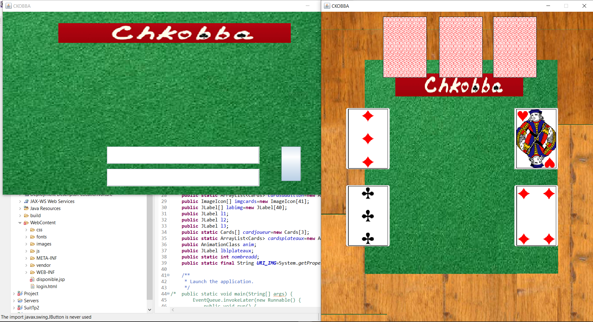

# CHKOBBA_JAVASWING

The chkobba (Arabic: شكبّة or škubba), also spelled chkobba or chkobba, is a card game taken from the scopa and brought to Tunisia by Italian migrants.

# About 
A Java game using the swing framework 
